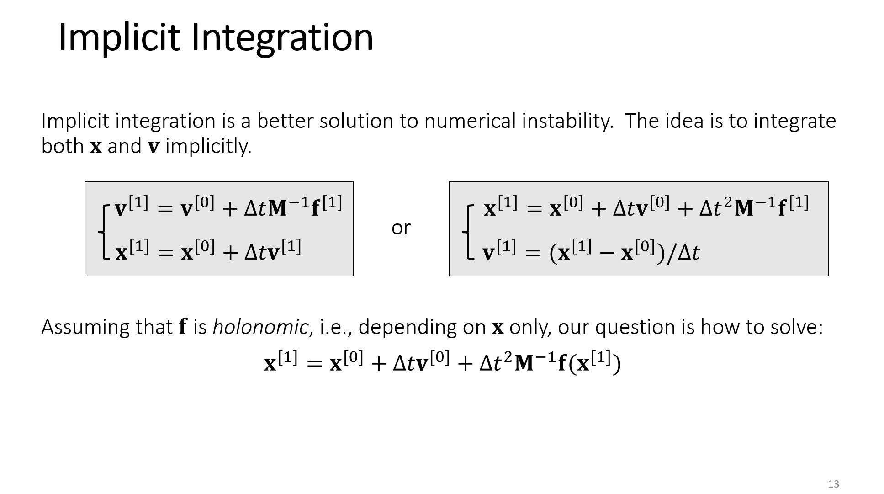
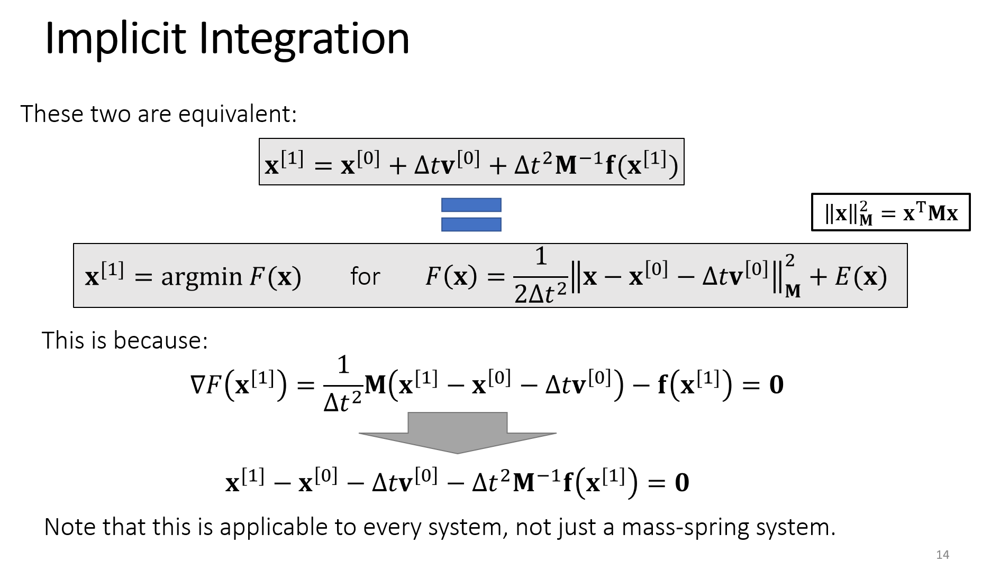
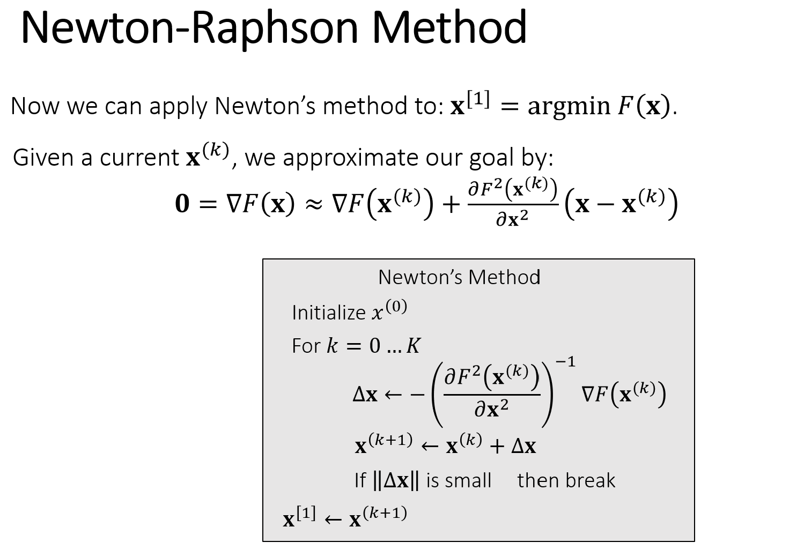
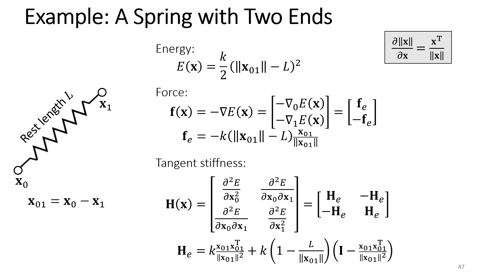
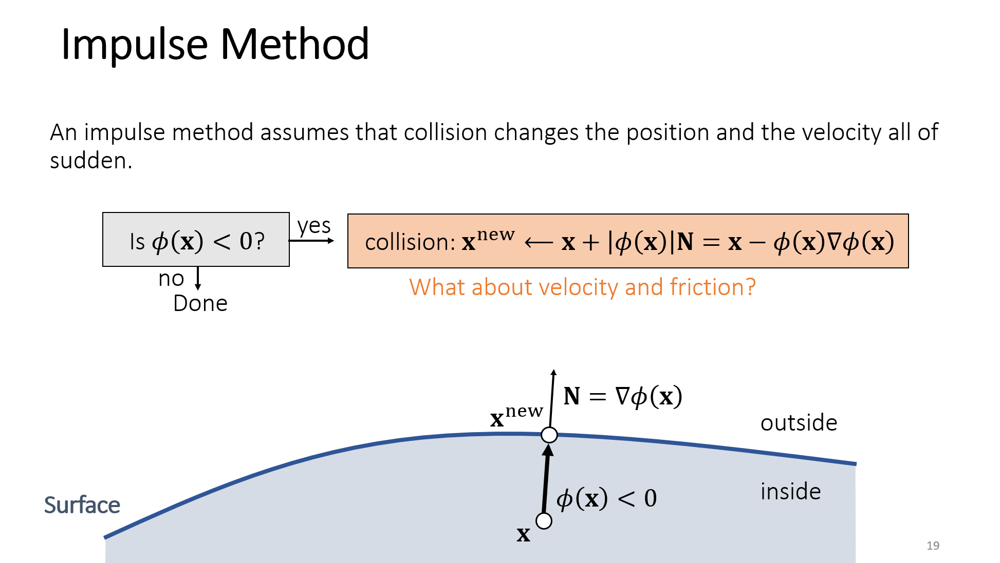
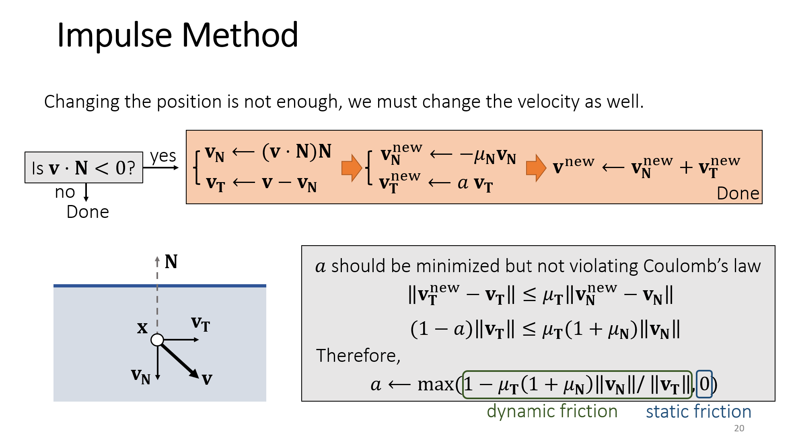

### 环境

Python 3.9.21

NumPy 2.0.1

SciPy 1.13.1

Warp 1.7.2 

### 文件结构

| 文件夹/文件结构                             | 说明                                       |
| :------------------------------------------ | :----------------------------------------- |
| **cloth_nv_warp（文件夹）**（待完成！！！）         | NVIDIA Warp Documentation 布料模拟示例程序 |
| - cloth_simulation.mp4                      | 运行’ read_usd.py‘ 的输出                  |
| - example_cloth.usd                         | 运行’ nv_warp_sim_cloth.py‘ 的输出         |
| - nv_warp_sim_cloth.py                      | **示例程序 -- 输出为USD文件**              |
| - read_usd.py                               | 读取USD文件（ai）                          |
|  |  |
| **cloth_simulation_by_zcy_first（文件夹）** |                                            |
| - cloth.py                                  | 布料类，弹簧类，布料类仿真方法       |
| - generate_fun.py                           | 生成布料/三角网格，弹簧            |
| - matplotlib_concurve_energy.py             | 绘制 energy **(还有问题)** （可直接运行！） |
| - matplotlib_concurve.py                    | 绘制 residual **(可能还有问题)** （可直接运行！） |
| - matplotlib_sim.py                         | 仿真动画生成（可直接运行！）   |
| - sim.py                                    | 仿真计算，结果储存                  |
|  |  |
| **ppt（文件夹）**                          |          |
| - 001-implicit_integration.png        | README插图，运动公式推导      |
| - 002-implicit_integration.png        |                        |
| - 003-newton_method.png               |                          |
| - 004-spring.png                      |                        |
| - 005-collision_impulse.png           |                        |
| - 006-collision_impulse.png           |                        |
| - GAMES-103-04_rigid_contact.pptx     | 刚体模拟ppt，含碰撞处理       |
| - GAMES-103-05_cloth.pptx             | 布料模拟ppt              |
| - GAMES-103-07_collision.pptx         | 碰撞处理ppt，自相交        |
| - homework_cloth.pdf                  | 布料模拟作业    |
|  |  |
| **README.md**                         |                                            |

### 运动公式推导

或见个人笔记: https://www.notion.so/Simulation-beginning-1f3af5a86ca2805caeb4c01b519e04a8?source=copy_link

- **第一步：**动力学公式-隐式积分（GAMES103 第五课）
  1. $x^{[0]}$表示当前时刻的位置；$x^{[1]}$表示下一时刻的位置，即求解目标。
  2. 图中，下方的隐式方程是一个非线性问题，需要迭代求解。

- **第二步：**隐式积分-优化问题（GAMES103 第五课）

  1. 这里可以将方程求根转为**最小**优化问题，最小优化问题的解一定是方程的根，但不是全部。

     即求解最小优化问题，是方程求根的充分不必要条件。

  2. 二阶导数 $\nabla^{2} F(x)$ **恒正定**时二者等价。

  3.  “能量” $F(x)$：

  $$
  F(\mathbf{x}) = \frac{1}{2\Delta t^2} \left\| \mathbf{x} - \mathbf{x}^{[0]} - \Delta t \mathbf{v}^{[0]} \right\|^2_{\mathbf{M}} + E(\mathbf{x})
  $$

  
  $$
  E(\mathbf{x}) = \frac{k}{2} (\|\mathbf{x}_{01}\| - L)^2
  $$

- **第三步：**牛顿迭代-非线性系统求解（GAMES103 第五课）

  1. 迭代中，上一时刻的值，如$x^{[0]}$均为常数/已知量。

  2. **程序中** $\nabla F(x)$ ，$\nabla^{2} F(x)$ 是按照下面的公式计算

     - $\nabla F(x) = x - x^{[0]} - \Delta t v^{[0]} - \Delta t^{2} M^{-1} f(x)$

       注意 $f$ 包括：弹簧力 $f_{spring}$ ，重力 $g$ ，其他外力。

     - $\nabla^{2} F(x) = I - \Delta t^{2} M^{-1} H$ 

       这里  $I$ 是单位矩阵，$H$ 指 $f$ 的一阶空间导数/梯度。

  3. $x^{[1]} = x^{(k+1)}$ ，其中$x^{(k+1)}$是在时刻 $^{[1]}$ 迭代求出的数值解。

- **第四步：**弹簧force-hessian-矩阵组装（GAMES103 第三课）
  1. 遍历所有弹簧并组装图片中的 $f(x)$ 就得到上一步的 $f_{spring}$。
  2. 由于重力 $g$ 关于空间的导数为零，遍历所有弹簧并组装图片中的 $H(x)$ 就得到上一步的 $-H$
     - 需要注意的是 $f_{e}$，$H_{e}$ 的正负号如何取；
     - 上一步中的 $H$ 指力的一阶导数，而不是图中能量的二阶导数，二者只有正负号的区别。

- **第五步：**碰撞处理-impulse method-位置（GAMES103 第四课）

  1. 程序中在牛顿迭代的每一步 $^{k+1}$ 后，

     直接修改 $x^{(k+1)}$ 和 $v^{(k+1)}$ 得到该步的最终解 $x^{(k+1)}_{final}$ 和 $v^{(k+1)}_{final}$ 并作为下一步的初值。

  2. 碰撞检测：遍历所有的点，检查穿透，即距离函数 $\phi (x) < 0 $  。

     - 距离函数 $\phi (x)$ 与碰撞对象有关；
     - 程序中的碰撞对象为球 （球心，半径）$(\vec c, r)$ ；
     - $\phi ( \vec x ) = \| \vec x - \vec c \| - r$；
     - $\vec N = \frac{\vec x - \vec c}{\| \vec x - \vec c \|}$。

  3. $ x^{(k+1)}_{final} = x^{(k+1)} + \phi ( \vec x ) \vec N$ 

     即，将穿透点推至表面。

- **第六步：**碰撞处理-impulse-速度（GAMES103 第四课）

  1. 速度检测： $\vec v \cdot \vec N  < 0 $  。

  2. 速度分解：

     - 法向 $\vec v_{N} = (\vec v \cdot \vec N) \vec N$
     - 径向 $\vec v_{T} = \vec v - \vec v_{N}$

  3. 碰撞➕能量损耗 $\mu_{N}$ ：

     -  $\vec v_{N}^{new} =- \mu_{N} \vec v_{N}$

  4. 摩擦 $\mu_{T}$ ：

     -  $\alpha_1 = 1-\mu_{T}(1+\mu_{N}) \frac{ \|\vec v_{N}\| }{ \|\vec v_{T}\| } $

     -  $\alpha = \max (\alpha_1, 0 )$

       - $\alpha_1$：滑动摩擦

       - 0：静摩擦

     -  $\vec v_{T}^{new} = \alpha \vec v_{T}$

  5. $ v^{(k+1)}_{final} = \vec v_{N}^{new} + \vec v_{T}^{new}$ 。

#### 部分程序细节说明

1. 程序中使用了两种碰撞处理方法
   - method = 2 为上述 impulse method （暂未调试合适）
   
   - method = 1 另一种碰撞处理的方法：
   
     - $$
       \vec{v}^{(k+1)}_{final} \leftarrow 
       \vec{v}^{(k+1)} 
       + \frac{1}{\Delta t} 
       \left( 
           \vec{c} 
           + r \frac{\vec{x}^{(k+1)} - \vec{c}}{\|\vec{x}^{(k+1)} - \vec{c}\|} 
           - \vec{x}^{(k+1)} 
       \right)
       $$
   
     - $$
       \vec{x}^{(k+1)}_{final} \leftarrow
       \vec{c} 
       + r \frac{\vec{x}^{(k+1)} - \vec{c}}{\|\vec{x}^{(k+1)} - \vec{c}\|}
       $$

2. 为了动画效果，计算使用的半径 $r = 1.0001$，绘制使用的半径 $r = 1$ 。

3. residual的计算：

   - $$
     \text{Residual}^{(k+1)} = \nabla F(\vec{x}^{(k+1)} ) 
     = \vec{x}^{(k+1)} - x^{[0]} - \Delta t v^{[0]} 
     - \Delta t^{2} M^{-1} f(\vec{x}^{(k+1)})
     $$

   - $$
     \text{Energy}^{(k+1)} = 
     F(\mathbf{\vec{x}^{(k+1)}}) 
     = \frac{1}{2\Delta t^2} \left\| \mathbf{\vec{x}^{(k+1)}} 
     - \mathbf{x}^{[0]} - \Delta t \mathbf{v}^{[0]} \right\|^2_{\mathbf{M}} + E(\mathbf{\vec{x}^{(k+1)}})
     $$

### 参考

[^1]: 王华民，https://games-cn.org/games103/，2021.

[^2]: NVIDIA Warp Documentation，https://nvidia.github.io/warp/，2025

